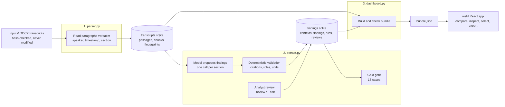

# Architecture

Three Python stages turn three interview transcripts into one checked JSON bundle, and a static React app renders
it. Every claim shown to a client points back to an exact transcript passage at a known version, and every stage can
be re-checked on its own.

## Components

| Stage | Owns | Writes | Checked by |
| --- | --- | --- | --- |
| `parser.py` | Canonical passages, citation IDs, exchange chunks, search | `data/parsed/transcripts.sqlite` | `python parser.py --check` |
| `extract.py` | Extraction schedule, findings contract, findings store, review log, gold gate | `data/parsed/findings.sqlite` | `--check`, `--evaluate` |
| `dashboard.py` | Bundle, prepared questions, bundle check | `web/src/data/bundle.json` | `python dashboard.py --check` |
| `web/` | React, TypeScript strict, Vite, Tailwind; types mirror the Python records | a static site in `web/dist/` | `npm test`, `npm run build` |

The two databases are separate on purpose: the parser never opens the findings store, and findings refer to
passages by ID plus fingerprint rather than by foreign key, so a changed transcript makes findings stale instead of
silently wrong.

## Evidence rules

- **Canonical text is never normalized.** Each paragraph is stored as written, with its speaker, timestamp, section,
  and original XML; each document records its source SHA-256 and an extraction fingerprint.
- **Fail closed.** A changed transcript, a tampered row, or a citation to the wrong version stops the check with an
  actionable error; stale findings are flagged, never relabeled as reviewed.
- **A finding is a bound proposal.** It names its company context, kind, vendor and relationship (deployed,
  previously used, evaluated, hypothetical), evidence type, optional quantity, and supporting, qualifying, and
  context passages.
- **Interviewer text is never evidence.** A premise the expert only agrees to is labeled prompted agreement.
- **Quantities keep the source's words.** No unit or currency conversion, no averaging across interviews; a rating
  given on a different scale than asked is labeled, never rescaled.
- **Review never inherits trust.** Every decision is logged; an edited finding is `edited` until reviewed again.

## Where AI is used, and where it is not

| Step | Done by | Why |
| --- | --- | --- |
| Reading the DOCX, IDs, fingerprints, quoting | Code | Must be exact and repeatable. |
| Proposing findings from a section | Model (`grok-4.6` by default) | Reading comprehension across varied answers. |
| Accepting a finding: cited passages shown, body text, right version, one role each; interviewer text never supports | Code | A model cannot certify its own citations. |
| Deciding a finding is right | A person (`--review`) | Only 3 of 304 dashboard findings are reviewed so far; the rest are labeled unreviewed. |
| Gold regression checks | Code | The spec: current versus former employer, units, corrections, market-share limit. |
| Judging meaning against rubrics (`--judge`) | Model (`claude-sonnet-5`), reported beside the gate, never in it | A second opinion where exact-match rules are brittle. |
| Rendering and exporting the brief | Code, in the browser | No model call at view time. |

## Stored versus computed

- **Stored:** canonical passages with source SHA-256 and extraction fingerprints; model runs with model, prompt
  version, and each section's outcome; findings and company contexts; every review decision.
- **Derived and re-checked:** chunks and the search index come from the passages (`parser.py` reuses them when the
  transcripts are unchanged; `--check` verifies them), and the bundle is rebuilt by `dashboard.py --build`.
- **In the browser only:** the analyst's selection and conclusion, in `localStorage`, keyed by the bundle
  fingerprint; the Markdown export is generated on download.

## Identifiers

Documents `E1`; passages `E1:B0032`; citations `E1:P021`; chunks `E1:X0024`; section batches `E1:S03`; link batches
`E1:L01`; company contexts `E1:C01`; findings `E1:F001`. Findings store physical passage IDs and display citation
IDs; quotations always come from the passage rows, never from model text.

## Quality gate

`python extract.py --evaluate` scores 18 gold cases from an evidence audit, on reviewed data and on raw model output
alone, and exits 1 until all pass. A case whose sections did not run reports `not_run`, never a pass.
`--compare BASE OTHER` sets two runs side by side. Every run is published in
[`results/`](results/) with its findings and gold result; [results/README.md](results/README.md) has the full
case-by-run table and the judge's verdicts, and [gold/cases.md](gold/cases.md) defines each case. In short, raw output:

| Run | Model | Gold, raw output |
| --- | --- | --- |
| Prompt 1.2.0 (the store the dashboard shows) | grok-4.7 | 6 of 18 (11 after review) |
| Prompt 1.4.0 | grok-4.7 | 10 of 18 |
| Prompt 1.5.0, fast model | grok-4.20-0309-non-reasoning | 6 of 18 |
| Prompt 1.5.0 | grok-4.6 | 17 of 18 |
| Prompt 1.6.0, five runs | grok-4.6 | 17, 13, 16, 15, 13 of 18 |
| Prompt 1.6.0 with `--skills synthesize-research competitive-brief` | grok-4.6 | 15 of 18 |

The spread across identical 1.6.0 runs (13 to 17) is larger than the change from adding skills, so one run cannot
show whether a prompt change helped.

## Limits

- A valid citation proves the passage exists at the expected version, not that it supports the statement; that is
  what review is for.
- The interviews describe specific buying decisions; they cannot estimate vendor market share, and nothing computes
  one.
- The parser's heading and speaker rules are verified for these three files, not for transcripts in general.
- No run yet passes all 18 gold cases. Several deterministic checks reject correct wording (G05, G09, G14, G15);
  the judge columns in [results/README.md](results/README.md) show where.

## Next

1. **Build on the best findings.** Swap the dashboard from the 1.2.0 store to a reviewed 1.6.0 run.
2. **Cross-company analysis layer.** Generate per-company briefs and cross-company themes from validated findings,
   with every bullet cited, labeled generated, and withheld when a citation fails.
3. **Review inside the dashboard,** writing to the existing review log.
4. **Repeated runs with pass rates** before adopting a prompt or model.
